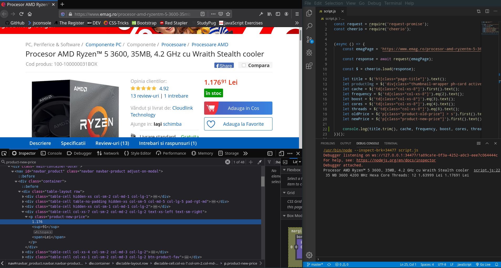

# price-web-scraper
Extract data from a webpage using node.js and cheerio

Documentation:  
Request-Promise https://github.com/request/request-promise  
Cheerio https://github.com/cheeriojs/cheerio  

The data can be seen in the Debug Console 

